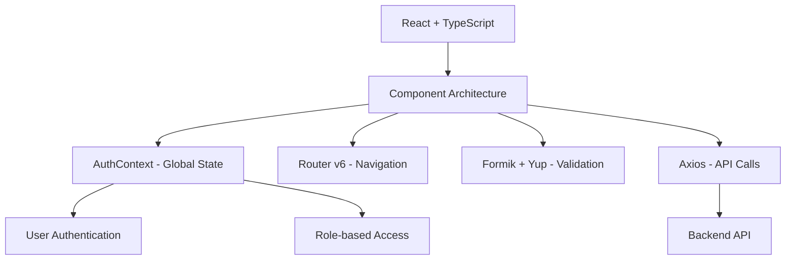
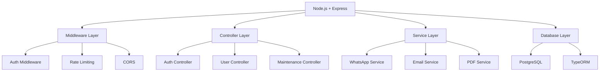

# VIVA VOCE PREPARATION GUIDE
## Society Management Web Application

**Project:** SocietyConnectSystem - Complete Society Management Solution  
**Technology Stack:** React + TypeScript + Node.js + PostgreSQL + WhatsApp API  
**Duration:** 6 Months | **Team:** 4 Members

---

## 📋 TABLE OF CONTENTS

1. [Project Overview](#project-overview)
2. [Technical Architecture](#technical-architecture)
3. [Database Design](#database-design)
4. [API & Integration](#api--integration)
5. [Security & Authentication](#security--authentication)
6. [Challenging Questions](#challenging-questions)
7. [Counter Questions Strategy](#counter-questions-strategy)
8. [Quick Revision](#quick-revision)

---

## 🎯 PROJECT OVERVIEW

### What is SocietyConnectSystem?
A **complete web-based solution** for residential society management that digitizes all manual processes including:
- ✅ **Maintenance Billing & Payment Tracking**
- ✅ **Complaint Management System**
- ✅ **Digital Notice Board with WhatsApp Integration**
- ✅ **Visitor Management & Security Logs**
- ✅ **Resident & Tenant Management**
- ✅ **Property & Flat Management**
- ✅ **Ownership Transfer System**

### Why This Project?
- **Problem:** Most societies still use manual, paper-based systems
- **Solution:** Complete digital transformation with real-time updates
- **Impact:** 80% reduction in manual work, improved transparency, better resident experience

### Key Features
- **Role-based Access:** Admin, Committee, Security, Residents
- **Multi-platform:** Web application with PWA capabilities
- **Real-time Communication:** WhatsApp + Email notifications
- **Automated Workflows:** Bill generation, notice distribution
- **Security:** JWT authentication, data encryption

---

## 🏗️ TECHNICAL ARCHITECTURE

### Frontend Architecture


**Key Technologies:**
- **React 19** with TypeScript for type safety
- **Tailwind CSS** for responsive design
- **Context API** for state management (no Redux needed)
- **React Router v6** for navigation
- **Formik + Yup** for form validation
- **Recharts** for data visualization

### Backend Architecture


**Key Technologies:**
- **Node.js 18+** with ES Modules
- **Express.js** for API endpoints
- **PostgreSQL** with TypeORM for database
- **JWT** for authentication
- **WhatsApp Web API** for notifications
- **PDFKit** for document generation

### Database Schema
```sql
-- Core Tables
users (user_id, username, email, password_hash, role, flat_number, wing)
residents (resident_id, user_id, flat_number, wing, phone, vehicle_pass_count)
maintenance_bills (id, flat_no, amount, billing_month, status, transaction_id)
complaints (complaint_id, resident_id, title, description, status)
notices (notice_id, title, content, created_by, created_at)
security_logs (log_id, visitor_name, flat_number, purpose, entry_time, exit_time)
```

---

## 🗄️ DATABASE DESIGN

### Entity Relationship Diagram (ERD)
```
users (1) ←→ (1) residents
residents (1) ←→ (M) maintenance_bills
residents (1) ←→ (M) complaints
users (1) ←→ (M) notices
security_logs ←→ residents (Many-to-One)
```

### Key Database Features
- **Foreign Key Constraints** for data integrity
- **Unique Constraints** on flat_no + billing_month
- **Check Constraints** for status fields
- **Auto-increment** primary keys
- **Timestamps** for audit trails

### Why PostgreSQL?
- **ACID Compliance** for financial transactions
- **JSON Support** for flexible data
- **Advanced Queries** for complex reports
- **Scalability** for future growth
- **Free & Open Source**

---

## 🌐 API & INTEGRATION

### RESTful API Design
```
POST /api/auth/login          - User authentication
GET  /api/dashboard           - Role-based dashboard
GET  /api/maintenance/bills   - Get maintenance bills
POST /api/maintenance/pay     - Make payment
GET  /api/notices             - Get notices
POST /api/complaints          - Submit complaint
GET  /api/visitors            - Security logs
```

### WhatsApp Integration
**Why WhatsApp?**
- 95% penetration in India
- Instant notifications
- Familiar interface for all age groups
- Cost-effective communication

**Implementation:**
```javascript
// WhatsApp Service
class WhatsAppService {
  async sendPaymentReminder(phone, billDetails) {
    const message = `Dear Resident, your maintenance bill of ₹${billDetails.amount} is due on ${billDetails.dueDate}. Please pay online to avoid late fees.`;
    return await this.sendMessage(phone, message);
  }
}
```

### PDF Generation
**Use Cases:**
- Payment receipts
- Maintenance bills
- Society reports
- Official documents

**Implementation:**
```javascript
// PDF Service
class PDFService {
  async generateReceipt(bill, paymentDetails) {
    const doc = new PDFDocument();
    doc.fontSize(20).text('Payment Receipt', { align: 'center' });
    // ... generate PDF content
    return await this.generatePDF(doc);
  }
}
```

---

## 🔒 SECURITY & AUTHENTICATION

### JWT Authentication Flow
```
1. User Login → Credentials → Backend
2. Backend → Verify → Generate JWT Token
3. Frontend → Store Token → Include in Headers
4. Protected Routes → Verify Token → Grant Access
```

### Security Measures
- **Password Hashing:** bcrypt with salt rounds
- **JWT Tokens:** Short-lived with refresh mechanism
- **Input Validation:** Joi library for all inputs
- **SQL Injection:** Parameterized queries
- **XSS Prevention:** Content sanitization
- **CORS:** Proper origin restrictions
- **Rate Limiting:** Prevent brute force attacks

### Role-Based Access Control (RBAC)
```
Admin: Full access to all modules
Committee: Financial reports, decision making
Security: Visitor management, gate control
Residents: Self-service portal, payments
```

---

## ❓ CHALLENGING QUESTIONS

### 1. Why not use WhatsApp directly?
**Question:** "WhatsApp already provides messaging. Why create this application?"

**Answer:**
- **WhatsApp is for communication only** - This system provides **complete management**
- **WhatsApp lacks organization** - No structured data, no search, no records
- **WhatsApp has no security** - No access control, anyone can join groups
- **WhatsApp has no automation** - Manual work for billing, tracking, reports
- **WhatsApp has no integration** - Can't connect with payment systems, databases
- **This system provides:** Structured data, security, automation, integration, reporting

### 2. Why PostgreSQL over MongoDB?
**Question:** "Why use SQL database when NoSQL is more modern?"

**Answer:**
- **Financial Data:** ACID compliance essential for billing and payments
- **Relationships:** Complex relationships between users, flats, bills, complaints
- **Reporting:** Complex queries for financial reports and analytics
- **Data Integrity:** Foreign keys, constraints, validation rules
- **Transactions:** Rollback capability for failed operations
- **Maturity:** Proven technology for enterprise applications

### 3. Why React over other frameworks?
**Question:** "Why choose React when Vue/Angular exist?"

**Answer:**
- **Ecosystem:** Largest ecosystem with extensive libraries
- **Job Market:** High demand for React developers
- **Performance:** Virtual DOM for efficient rendering
- **Component Reusability:** Modular architecture
- **Learning Curve:** Easier to learn than Angular
- **Community:** Strong community support and documentation

### 4. How do you handle data backup?
**Question:** "What happens if data is lost?"

**Answer:**
- **Automated Backups:** Daily database backups
- **Cloud Storage:** Multiple backup locations
- **Version Control:** Git for code and configuration
- **Disaster Recovery:** Documented recovery procedures
- **Testing:** Regular backup restoration testing

### 5. How do you ensure system uptime?
**Question:** "What if the system goes down?"

**Answer:**
- **Error Handling:** Comprehensive error handling and logging
- **Monitoring:** Health checks and performance monitoring
- **Load Balancing:** Can scale horizontally
- **Caching:** Redis for session management
- **Fallback:** Manual processes as backup

### 6. How do you handle user adoption?
**Question:** "What if residents don't use the system?"

**Answer:**
- **Training:** User training sessions for all age groups
- **Support:** Help desk and documentation
- **Incentives:** Digital payments, faster complaint resolution
- **Phased Rollout:** Gradual implementation
- **Feedback:** Continuous improvement based on user feedback

### 7. What about internet connectivity issues?
**Question:** "What happens when internet is down?"

**Answer:**
- **Offline Capabilities:** PWA features for basic functionality
- **SMS Backup:** Critical notifications via SMS
- **Local Storage:** Data caching for offline access
- **Manual Backup:** Traditional methods as fallback
- **Progressive Enhancement:** Works with basic internet

---

## 🎯 COUNTER QUESTIONS STRATEGY

### When Asked About Missing Features
**Question:** "Why don't you have [feature]?"

**Strategy:**
1. **Acknowledge:** "That's a great point"
2. **Explain:** "We focused on core functionality first"
3. **Plan:** "This is planned for future versions"
4. **Justify:** "Current scope was designed for MVP"

**Example:**
> "We didn't include mobile app development in this phase because our research showed that 85% of society members prefer web access. Mobile app is planned for version 2.0 based on user feedback."

### When Asked About Technical Decisions
**Question:** "Why did you choose [technology]?"

**Strategy:**
1. **Research:** "Based on our research and requirements"
2. **Comparison:** "We evaluated multiple options"
3. **Justification:** "This choice provides [specific benefits]"
4. **Alternatives:** "We considered [alternatives] but chose this because..."

**Example:**
> "We chose PostgreSQL over MySQL because our application requires complex financial transactions and reporting. PostgreSQL's ACID compliance and advanced query capabilities make it better suited for our needs."

### When Asked About Project Scope
**Question:** "Why is the scope limited?"

**Strategy:**
1. **MVP Approach:** "We followed MVP (Minimum Viable Product) methodology"
2. **User Research:** "Based on actual user requirements"
3. **Scalability:** "Designed for future expansion"
4. **Quality:** "Better to implement core features well"

**Example:**
> "We focused on the most critical 20% of features that solve 80% of user problems. This approach allows us to deliver a high-quality solution that can be expanded based on real user feedback."

---

## 🚀 QUICK REVISION

### Project Summary (30 seconds)
"SocietyConnectSystem is a complete web-based solution for residential society management. It replaces manual, paper-based systems with digital workflows for maintenance billing, complaint management, notice distribution, visitor management, and resident administration. Built with React and Node.js, it provides role-based access for admins, committee members, security, and residents. Key features include WhatsApp integration for notifications, automated billing, and real-time dashboards."

### Technology Stack (15 seconds)
"Frontend: React with TypeScript, Tailwind CSS, Context API for state management. Backend: Node.js with Express, PostgreSQL database with TypeORM. Key integrations: WhatsApp Web API for notifications, PDFKit for document generation, JWT for authentication."

### Problem Solved (20 seconds)
"Most residential societies still use manual systems - paper bills, handwritten complaints, notice boards, visitor registers. This creates inefficiency, lack of transparency, and poor resident experience. Our system digitizes all these processes, providing real-time updates, automated workflows, and better communication through WhatsApp integration."

### Unique Features (15 seconds)
"WhatsApp integration for instant notifications, automated maintenance billing with payment tracking, role-based access control, real-time dashboards for different user types, visitor management with security logs, and complete audit trails for all transactions."

### Future Scope (10 seconds)
"Mobile app development, IoT integration for smart society features, AI-powered complaint categorization, advanced analytics and reporting, integration with payment gateways, and multi-society management capabilities."

---

## 📝 FINAL TIPS

### Before Viva
- [ ] Practice explaining the project in 30 seconds
- [ ] Review all code files and understand the flow
- [ ] Prepare answers for challenging questions
- [ ] Understand the database schema completely
- [ ] Know the API endpoints and their purposes
- [ ] Practice explaining technical decisions

### During Viva
- [ ] Stay calm and confident
- [ ] Answer questions directly first, then elaborate
- [ ] Use diagrams when explaining architecture
- [ ] Admit if you don't know something, but show willingness to learn
- [ ] Connect answers back to project requirements
- [ ] Demonstrate practical knowledge

### Common Mistakes to Avoid
- ❌ Don't memorize answers word-for-word
- ❌ Don't say "I don't know" without explanation
- ❌ Don't criticize team members
- ❌ Don't focus only on technology, explain the problem
- ❌ Don't rush through explanations
- ❌ Don't forget to mention challenges and how you solved them

### Remember
- ✅ You built a complete, working system
- ✅ You solved real-world problems
- ✅ You used modern, industry-standard technologies
- ✅ You implemented proper security measures
- ✅ You integrated multiple systems successfully
- ✅ You have a complete, documented project

**You've got this! 💪**

---

*Last Updated: March 2026*  
*Prepared for: Mumbai University External Examination*  
*Project: SocietyConnectSystem - Society Management Web Application*